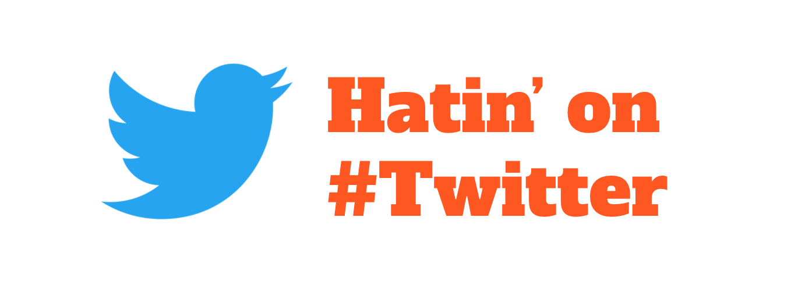

  

## This project examines users tweeting hate speech on Twitter and visualizes the findings in relation to:
-State data

-Median income data

-Twitter follower information

-Education level

## Libraries Used:
* Matplotlib.pyplot
* Seaborn
* NumPy
* Pandas

## Run With:
* Jupyter Notebook

  
# Documentation:  

  
  

